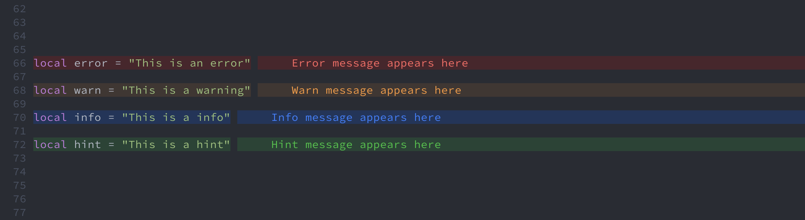

# 🔎 Error Lens for Neovim

An enhanced visual diagnostic display for Neovim, inspired by the [Error Lens extension for Visual Studio Code](https://github.com/usernamehw/vscode-error-lens).

## 📸 Showcase



## ✨ Features

- Visually supportive diagnostic messages
- Telescope Extension sorting by severity
- Customizable colors and appearance
- Auto-adjust colors based on the theme color
- Easy setup with all package managers
- Togglable
- Heavily inspired by the Error Lens plugin for Visual Studio Code

## 🚧 Roadmap

- [x] Telescope Extension
- [x] Togglable hints
- [x] Auto adjust colors based on theme
- [x] Custom colors

## ⚡️ Requirements

- Neovim >= 0.5
- Properly configured Neovim LSP client

## 📦 Installation

Install the plugin with your preferred package manager:

### packer

```lua

use {
    'chikko80/error-lens.nvim',
    requires = {'nvim-telescope/telescope.nvim'}
}

require("error-lens").setup(client, {
    -- your options go here
})
```

### lazy.nvim

```lua
{
    "chikko80/error-lens.nvim",
    event = "BufRead",
    dependencies = {
        "nvim-telescope/telescope.nvim"
    },
    opts = {
        -- your options go here
    },
}
```

## ⚙️ Configuration

error-lens.nvim comes with the following default options:

```lua
{
  -- this setting tries to auto adjust the colors
  -- based on the diagnostic-highlight groups and your
  -- theme background color with a color blender
  enabled = true,
  auto_adjust = {
    enable = false,
    fallback_bg_color = nil, -- mandatory if enable true (e.g. #281478)
    step = 7, -- inc: colors should be brighter/darker
    total = 30 -- steps of blender
  },
  prefix = 4, -- distance code <-> diagnostic message
  -- default colors
  colors = {
    error_fg = "#FF6363", -- diagnostic font color
    error_bg = "#4B252C", -- diagnostic line color
    warn_fg = "#FA973A",
    warn_bg = "#403733",
    info_fg = "#5B38E8",
    info_bg = "#281478",
    hint_fg = "#25E64B",
    hint_bg = "#147828"
  }
}
```

## 🚀 Usage

After installing and configuring the plugin, it will automatically enhance the diagnostic display in Neovim.

To call the Telescope Error Lens `:ErrorLensTelescope`

To disable/toggle the plugin temporarily, use `:ErrorLensToggle`

## ⌨️ You just switch from VsCode and used OneDarkPro?

If you're switching from VSCode and are used to the beloved [OneDarkPro Theme](https://marketplace.visualstudio.com/items?itemName=zhuangtongfa.Material-theme),
you can use its equivalent for Neovim: [olimorris/onedarkpro.nvim](https://github.com/olimorris/onedarkpro.nvim).

The default colors are set up for this theme, and i've tried my best to match the colors (despite the lack of opacity in nvim).

## ⚠️ Disclaimer:

I recently switched from VsCode to Neovim and really missed that plugin. Therefore i tried to code it myself.
I am not really familiar with Lua, so if you find any bugs please raise an issue.
PRs and improvements or ideas are also welcome.

## 📚 Credits

This plugin is heavily inspired by the [Error Lens extension](https://github.com/usernamehw/vscode-error-lens) for Visual Studio Code.
